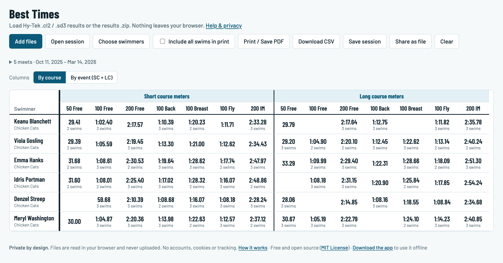
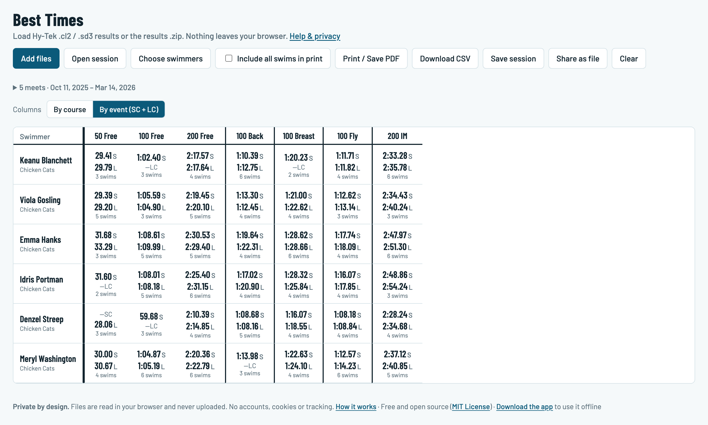

# Swim Times Coach

See every swimmer's best times on one page, straight from Hy-Tek meet results.
Load `.cl2` result files from as many meets as you like, pick your swimmers, and
get a best-times table you can click through, print or export.

**Private by design:** everything happens in your browser. Result files are
never uploaded, and nothing about your swimmers leaves your computer.

**[Try the live demo »](https://swimtimescoach.com/demo.html)** with a made-up team: tap any time to see
every swim.

## Privacy

Meet results contain children's names, ages and times, so the app is built to
keep them on your device:

- **Nothing is uploaded.** Files are read by the page itself, in your browser.
  There is no server, no account and no database.
- **The browser enforces it.** The page carries a Content Security Policy that
  blocks it from sending anything over the network (`connect-src 'none'`) and
  from loading code, fonts or styles from anywhere but its own files. Even a
  future bug or added script couldn't quietly send data out.
- **Nothing is kept.** No cookies, no tracking, no browser storage. Closing
  the tab or pressing **Clear** forgets everything.
- **What you save is yours.** Saved sessions, PDFs and CSVs are ordinary files
  on your computer. They contain swimmers' names and results, so share them
  only with people who should see them.

If you use a hosted copy of the app (for example on GitHub Pages), the host
only serves the app's own files. Your result files are still read in your
browser and never reach the host.

## Getting started

Use it online at **https://swimtimescoach.com**. Nothing to install, and your
files are still read only in your browser.

Or **download the app as one file**:
[swimtimescoach.com/swimtimescoach.html](https://swimtimescoach.com/swimtimescoach.html)
(about 270 KB, also linked in the app's footer). Double-click it and it opens
in your browser with everything built in: it works offline, needs no install,
and keeps the same privacy protections. It doesn't update itself, so download
it again now and then for new features.

Want to try it first? Download the five `.cl2` files in
[`docs/sample-data/`](docs/sample-data) (a made-up team, safe to share) and
add them to the app.

To work on the code, open `index.html` in a browser or start a local server:

```sh
npm run serve        # http://localhost:8000, reachable from this computer only
```

## User guide

The same guide is in the app under **Help & privacy**.

### 1. Load results
- Get meet results as **`.cl2`** files: Hy-Tek's results export, usually from
  the meet host or results site. **`.sd3`** files and **`.zip`** results
  archives work too.
- Click **Add files** or drop them on the page. Add more meets at any time; a
  file that's already loaded is skipped.

### 2. Choose swimmers
**Choose swimmers** lists everyone in the loaded meets. Search by name or
filter by team, then **Show table**. With 15 swimmers or fewer, everyone is
selected automatically.

### 3. Read the table
Each cell is a swimmer's best time in that event. *"3 swims"* under a time
means there are more: click the time to see every swim in that event, with the
best marked. DQ, NS, SCR and DNF never count as a best time.

Two views, switched with **Columns** above the table:

| View | Layout |
|---|---|
| **By course** | Each course gets its own columns: short course yards, short course meters, long course meters. |
| **By event (SC + LC)** | One column per event. Each cell stacks the short-course best over the long-course best, with Hy-Tek's course letters: **Y** yards, **S** short course meters, **L** long course meters, e.g. `35.31S` over `34.06L`. **—SC** or **—LC** means no swim in that course; a blank cell means no swims at all. |

**By course**: each course in its own block of columns.

[](https://swimtimescoach.com/demo.html)

**By event (SC + LC)**: short course over long course in one column per event.

[](https://swimtimescoach.com/demo.html)

*Click either screenshot to open the [live demo](https://swimtimescoach.com/demo.html) and try it. Both use the
made-up sample team in [`docs/sample-data/`](docs/sample-data).*

Yards and meters times are never compared, so each course keeps its own best.
500/1000/1650 yards free share a column with 400/800/1500 meters, and the
header lists only the distances actually swum ("400 Free" for a meters-only
team, "400/500 Free" when both appear).

### 4. Save, print, export
- **Save session** downloads one `.zip` with every loaded meet, the swimmers
  you picked and the current view. Reopen it later with **Open session** (or
  drop it on the page) to pick up where you left off. It's an ordinary zip:
  unzip it to get the original `.cl2` files back.
- **Print / Save PDF** prints the table in landscape. Tick **Include all swims
  in print** to add every swim after the table.
- **Download CSV** gives the best-times table and every individual swim, for
  spreadsheets. It follows the current view.
- **Share as file** makes one `.html` file with just the swimmers you picked,
  to send by WhatsApp or email. The receiver taps it and the table opens in
  their browser: no website, no upload, fully interactive. It contains only
  those swimmers' individual results (no relays, splits or other swimmers).
  Where a phone only shows a preview without running scripts, the file still
  shows the best-times table and every swim; for the interactive version,
  open swimtimescoach.com, tap **Open session** and choose the file. Expect
  about 1 MB for a 70-swimmer team, under 300 KB for one swimmer.

### Good to know
- Swimmers are matched across meets by name. If a name is spelled differently
  in two meets, they show as two people. Two swimmers with the same name are
  told apart by their USS IDs when the files include them.
- Meets that share a name (the same invitational every year) stay separate,
  labelled with the year, date, city or file name, whichever tells them apart.
- Relays aren't shown yet; only individual swims.

## For developers

Plain HTML, CSS and JavaScript: no build step, no framework, no runtime
dependencies. Third-party code and fonts are vendored in `vendor/`.

```sh
npm test                      # all tests, Node 18+, no dependencies
python3 tests/gen_fixtures.py # regenerate synthetic fixtures
npm run serve                 # local server on 127.0.0.1:8000
npm run build-share           # build src/share-template.js ("Share as file"), swimtimescoach.html (downloadable app), demo.html
```

Every push to `main` runs the tests and, if they pass, publishes `index.html`,
`src/` and `vendor/` to GitHub Pages (`.github/workflows/pages.yml`), after
building the app as one self-contained page: `src/share-template.js` (that
page as a string, for **Share as file**) and `swimtimescoach.html` (the same
page with no data: the downloadable app, which copies its own page to share
from), plus `demo.html` (that page loaded with the sample team). All are
generated and git-ignored; the website can't assemble them
itself because its CSP stops it from reading its own files at run time. The shared page
has its own CSP: only its exact inline scripts (by SHA-256 hash), embedded
fonts, no network.

Privacy rules for changes: keep the Content Security Policy in `index.html`
as strict as it is (in particular `connect-src 'none'`), load nothing from
other sites, and don't store result data in the browser.

| Path | What it is |
|---|---|
| `index.html` | Page markup, Content Security Policy, in-app help |
| `src/cl2.js` | SDIF v3 / CL2 parser, plus swimmer matching, best times and meet labels (browser global `CL2`, or `require` in Node) |
| `src/app.js` | UI: file loading, swimmer picker, grid, detail dialog, print, CSV, sessions |
| `src/session.js` | Save/open a session `.zip` (meet files + `session.json`) |
| `src/styles.css` | Styles, including light/dark theme and print layout |
| `vendor/jszip.min.js` | JSZip 3.10.1, for reading `.zip` files |
| `vendor/fonts/` | Barlow and Barlow Condensed (latin, SIL OFL) |
| `tests/` | Node tests and synthetic fixtures |
| `tools/anonymize.js` | Turns real `.cl2` files into anonymized local test fixtures |
| `tools/make_sample_data.py` | Generates the made-up sample meets in `docs/sample-data/` (README screenshots, try-it files) |
| `docs/images/` | README screenshots |
| `tools/build-share.js` | Builds the one-file app: the **Share as file** template and the downloadable `swimtimescoach.html` |
| `docs/sdif-v3-notes.md` | Record layouts the parser relies on |

### License

[MIT](LICENSE), Copyright (c) 2026 Panteley Matanov: free to use, copy, change
and share, including commercially, as long as the copyright notice comes along.

Bundled third-party code and fonts keep their own licenses:

| Component | License |
|---|---|
| [JSZip](https://stuk.github.io/jszip/) 3.10.1 (`vendor/jszip.min.js`) | MIT (or GPLv3), notice kept in the file |
| [Barlow](https://github.com/jpt/barlow) fonts (`vendor/fonts/`) | SIL Open Font License 1.1, see `vendor/fonts/OFL.txt` |

The downloadable app and shared files carry the same notices in their `<head>`.

### Testing with real meet files

Real results contain children's names, birth dates and IDs, so they are
anonymized locally first and never committed:

```sh
npm run anonymize -- ~/path/to/real-cl2-folder          # one team in the files
npm run anonymize -- ~/path/to/folder --list-teams      # several teams: see codes (run it yourself)
npm run anonymize -- ~/path/to/folder --our-team CODE   # ...then pick yours
```

Swimmers get mixed movie-star names, our team becomes Chicken Cats, other
teams and meets get fake names, and USS IDs and birth dates are replaced. The
same swimmer gets the same fake name in every file and on every run, via a
mapping kept at `~/swim-private/cl2-mapping.json` (`--map` to change; it must
be outside the repo, since it holds the real names). Output goes to the
git-ignored `tests/fixtures-private/`, where `npm test` picks it up. Before
writing anything, the script checks that no real name, ID, team or meet
appears in the output, and that the app parses every swim identically.
Relay and split records are dropped, since the app doesn't use them yet.
